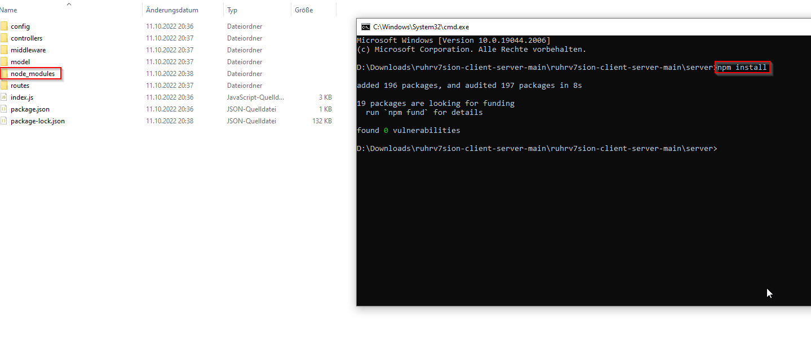
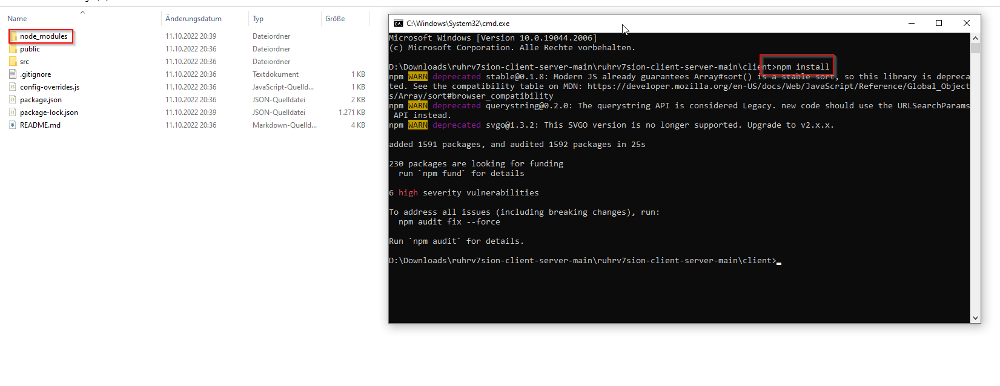

# ruhrv7sion-client-server - structure

## .env file is temporarily synchronised

* Famous TechStack: MERN = MongoDB + Express + React + NodeJS
* Development = Backend Node.js server + Frontend React server
* Production = Backend Node.js server + static react files on a webserver
* MongoDB is running in the web and not localy. For this project to work the .env file is needed in the backend. More about this below.
* Frontend: For the style we used the CSS framework react-boostrap (Boostrap). The CSS framework "Mui" was also used sporadically. 


# DISCLAIMER! Please note the following for this project!
* The attached images are royalty-free and were obtained from pixabay.com and pexels.com (no attribution required). Icons were taken directly from Bootstrap, MUI and REACT.
* The font is called "Asap" and is from GoogleFonts. This is included locally and NOT via "stylesheet link". 
* This website uses cookies (JWT cookie for a session-user management), but has no necessary cookie banner or query.


# Installation
If you don't want to work with the repository and "just" want to run it, you can download the repository as a ZIP and extract it. Then you can skip step 1 and 2.

1. Install Node.js + NPM ([Short instruction from the documentaion](https://docs.npmjs.com/downloading-and-installing-node-js-and-npm))
2. Clone Repository using e.g. GitHub Desktop (recommended) ([Github Desktop](https://desktop.github.com/))
3. !node_moduels are needed to be installed: 
3.1 Navigate a terminal to your server folder
3.2 Enter: ``` npm install ```
4. Repeat step 3. for the client folder

###Steps pictures
1. After running npm install the node_modules fodler should be created


2. After running npm install the node_modules fodler should be created


3. Do not forget the -env file! 


## Run React server (port 3000)
1. Navigate a terminal to your client folder
2. Enter the following code: ``` npm start ```

## Run Node dev server (port 1337)
1. Navigate a terminal to your server folder
2. Enter the following code: ``` npm run dev ```

## .env file 
1. Create .env file in folder named "server"
2. For the backend to work at all, the fields must be filled in. Please contact Nils Pautzke in SLACK.
Sampledata:
```
    PORT=XXX
    ACCESS_TOKEN_SECRET=XXX
    REFRESH_TOKEN_SECRET=XXX
    DATABASE_URI=XXX
```

# Using the website
You can create an account or use the following company account. The data for this account has already been filled in.
```
Username: Company1
Password: Company1!
```
